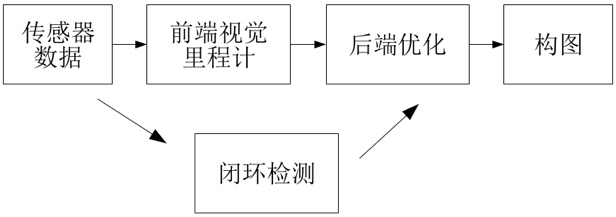
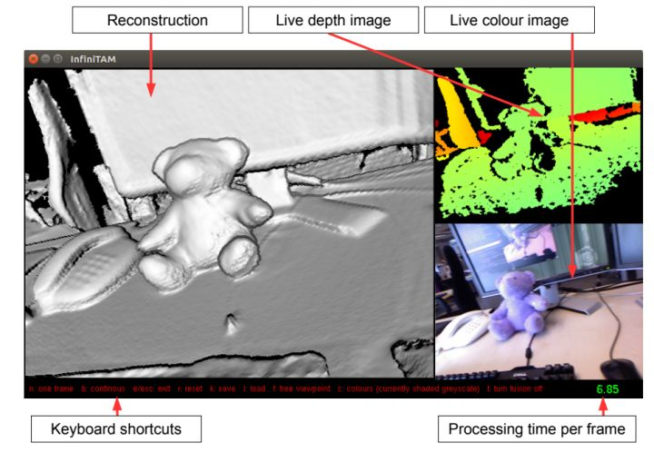

# SLAM和SFM（三维重建）调研

- SLAM就是同时定位与制图，三维重建是制图的一部分，同时三维重建也要用到定位信息，这两者本就是考虑同样的问题。

## **一、SLAM相关工作介绍**

- SLAM：SLAM主要包括视觉SLAM和激光SLAM两个方面的内容；

    
     
    
slam研究点

    
     
    
经典vSLAM系统流程图

1. 视觉里程计 (Visual Odometry)：仅有视觉输入的姿态估计；
2. 后端优化 (Optimization): 后端接受不同时刻视觉里程计测量的相机位姿，以及闭环检测的信息，对它们进行优化，得到全局一致的轨迹和地图；
3. 闭环检测 (Loop Closing): 指机器人在地图构建过程中, 通过视觉等传感器信息检测是否发生了轨迹闭环, 即判断自身是否进入历史同一地点;
4. 建图 (Mapping): 根据估计的轨迹，建立与任务要求对应的地图。

[**相关算法介绍**]()

1. ORB-SLAM

    代码：https://github.com/raulmur/ORB_SLAM

2. ORB-SLAM2

    代码：https://github.com/raulmur/ORB_SLAM2

    
     
    
orb-slam2

    
     
    
orb-slam2

    
     
    
orb-slam2

3. ORB-SLAM3

    代码：https://github.com/UZ-SLAMLab/ORB_SLAM3

    
     
    
orb-slam3

## **二、SFM相关工作介绍**

- 三维重建作为环境感知的关键技术之一，可用于自动驾驶、虚拟现实、运动目标监测、行为分析、安防监控和重点人群监护等。三维重建是指根据单视图或者多视图的图像重建三维信息的过程. 由于单视频的信息不完全,因此三维重建需要利用经验知识. 而多视图的三维重建(类似人的双目定位)相对比较容易, 其方法是先对摄像机进行标定, 即计算出摄像机的图象坐标系与世界坐标系的关系.然后利用多个二维图象中的信息重建出三维信息。

整体流程：硬件 -> 数据 -> 稀疏/点云/相机参数重建 -> 网格化 -> 纹理化

1. 硬件

    主要是考虑应用和成本，不要高射炮打蚊子，也别想癞蛤蟆吃天鹅肉。具体来说，包括静态场景 （预矫正的相机组+光源），高端扫描仪（拍照式投影扫描，高精度激光扫描），低端三维扫描仪（低端的LiDar, kinect等结构光和ToF的设备），双目摄像头，单目摄像头。
    
2. 数据

    颜色（单反和屌丝相机，视频还是静态图片），深度图（来自于高低端扫描仪），点云（LiDar），IMU（如果你在用手机等带传感器等东西）。

3. 融合算法，三维化算法

4. 网格重建

    网格现有的一些TSDF和柏松重建的方式各自都有很多缺陷

5. 和纹理重建

    纹理重建主要是为视觉服务，也有很多难点

### **基于RGBD的实时三维重建工作**

    需要RGBD相机，相机贵； 相关算法介绍:

1. KinectFusion

    代码未开源，早期代码，https://github.com/chrdiller/KinectFusionLib

    
     
    
KinectFusion

2. Kintinuous和ElasticFusion

    代码：Kintinuous, https://github.com/mp3guy/Kintinuous

    代码：ElasticFusion, https://link.zhihu.com/?target=https%3A//github.com/mp3guy/ElasticFusion

    
     
    
Kintinuous2.0重建效果

    
     
    
Kintinuous2.0重建效果

3. ElasticReconstruction

    项目官网：http://qianyi.info/scene.html

    代码：https://github.com/qianyizh/ElasticReconstruction

    
     
    
ElasticReconstruction重建效果

4. InfiniTAM

    官网：http://www.robots.ox.ac.uk/~victor/infinitam/

    代码：https://github.com/victorprad/InfiniTAM

    
     
    
InfiniTAM重建效果

5. DynamicFusion

    官网：https://grail.cs.washington.edu/projects/dynamicfusion/

    代码：https://github.com/mihaibujanca/dynamicfusion
    

    
     
    
DynamicFusion重建效果

6. BundleFusion

    据说是现在重建效果最好的工作！

    官网：BundleFusion

    论文：https://arxiv.org/pdf/1604.01093.pdf

    代码：https://github.com/niessner/BundleFusion

### **普通的RGB相机去进行动态三维**
    只用一个RGB相机去完成重建，成本低；相关算法介绍：

1. NRSfM(NonRigid Structure from Motion)

    论文：https://www.cv-foundation.org/openaccess/content_cvpr_2013/papers/Garg_Dense_Variational_Reconstruction_2013_CVPR_paper.pdf

    
     
    
NRSfM(NonRigid Structure from Motion)重建效果

2. SfT(Shape from Template)

    论文：https://arxiv.org/pdf/1811.07791.pdf

    
     
    
SfT(Shape from Template)重建效果

    
     
    
SfT(Shape from Template)-demo重建效果

3. Lourdes Agapito团队的工作

    项目主页：http://www0.cs.ucl.ac.uk/staff/R.Yu/direct_nrsfm/direct_nrsfm.html

    代码：https://link.zhihu.com/?target=https%3A//github.com/cvfish/PangaeaTracking

    
     
    
Lourdes Agapito团队的工作

4. Lourdes Agapito团队的工作-改进工作：

    论文地址：http://www0.cs.ucl.ac.uk/staff/Qi.Liu/bmvc16/better_together.pdf

    项目主页：http://www0.cs.ucl.ac.uk/staff/Qi.Liu/bmvc16/better_together.html

    代码：https://github.com/qilon/PangaeaTracking

    
     
    
Lourdes Agapito团队的工作-改进工作

5. 马普所团队的工作

    论文地址：https://gvv.mpi-inf.mpg.de/projects/LiveCap/data/livecap.pdf

    项目地址：https://gvv.mpi-inf.mpg.de/projects/LiveCap/

    
     
    
马普所团队的工作

## 三、SLAM,SFM的区别与联系
- 区别
1. SLAM要求实时，数据是线性有序的，无法一次获得所有图像，部分SLAM算法会丢失过去的部分信息；基于图像的SfM不要求实时，数据是无序的，可以一次输入所有图像，利用所有信息。
2. SLAM是个动态问题，会涉及到滤波，运动学相关的知识，而SfM主要涉及的还是图像处理的知识。
- 联系
1. 基本理论是一致的，都是多视角几何；
2. 传统方法都需要做特征值提取与匹配；
3. 都需要优化投影误差；
4. 回环矫正和SfM的全局注册方法是同一件事情。

## 四、工作展望

1. SLAM和SFM对数学知识、数据结构、编程要求非常高；
2. SLAM和SFM相关的硬件较贵，例如，SLAM激光雷达，SFM双目摄像头，深度摄像头；
3. 

## 五、research参考

1. 如何评价高博的《视觉SLAM十四讲》：https://www.zhihu.com/question/56630075
2. 视觉SLAM漫谈 (三): 研究点介绍：https://www.cnblogs.com/gaoxiang12/p/4395446.html
2. 《快看，那个学SLAM 的崩溃了》:https://zhuanlan.zhihu.com/p/62336523
3. 三维重建 3D reconstruction 有哪些实用算：https://www.zhihu.com/question/29885222/answer/918009389
4. 重磅解读！ORB-SLAM3，它来了，新增鱼眼模型、多地图等：https://www.jianshu.com/p/3e2001a37fa5

